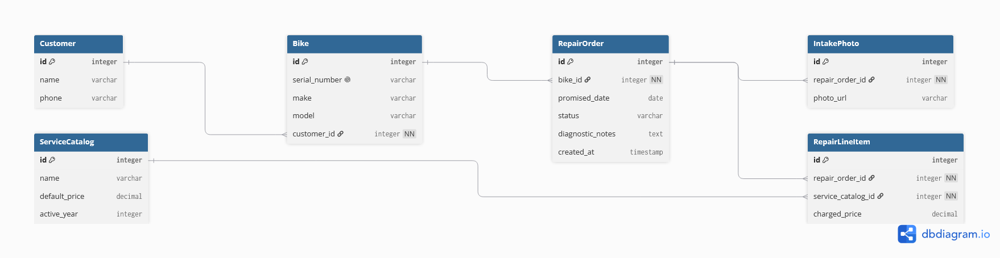

# Wheelhouse Domain Model

## 1. Domain Model Diagram (DBML)



```dbml
Table Customer {
  id integer [primary key]
  name varchar
  phone varchar
}

Table Bike {
  id integer [primary key]
  serial_number varchar [unique]
  make varchar
  model varchar
  customer_id integer [ref: > Customer.id]
}

Table ServiceCatalog {
  id integer [primary key]
  name varchar
  default_price decimal
  active_year integer
}

Table RepairOrder {
  id integer [primary key]
  bike_id integer [ref: > Bike.id]
  promised_date date
  status varchar
  diagnostic_notes text
  created_at timestamp
}

Table RepairLineItem {
  id integer [primary key]
  repair_order_id integer [ref: > RepairOrder.id]
  service_catalog_id integer [ref: > ServiceCatalog.id]
  charged_price decimal
}

Table IntakePhoto {
  id integer [primary key]
  repair_order_id integer [ref: > RepairOrder.id]
  photo_url varchar
}
```

## 2. Repair Order Lifecycle

### States

- **Dropped Off** — The bike is received at the counter, tagged, photographed, and added to the workshop queue.
- **Awaiting Estimate Approval** — Diagnostics are complete and the customer has been contacted with a cost estimate; awaiting customer decision.
- **In Progress** — Work is approved and currently being executed by a mechanic.
- **Ready for Pickup** — All work (or declined work) is complete, and the bike is on the rack waiting for the customer.
- **Picked Up** — The customer has collected the bike and the repair order is officially closed.

### Allowed Transitions

- **Dropped Off → Awaiting Estimate Approval**: Diagnostic evaluation finished; quote sent to customer.
- **Dropped Off → In Progress**: Quick jobs (e.g., standard flat tyre replacement) proceeding directly without formal quote waiting.
- **Dropped Off → Ready for Pickup**: Customer declines inspection/work immediately after drop-off.
- **Awaiting Estimate Approval → In Progress**: Customer approves estimate.
- **Awaiting Estimate Approval → Ready for Pickup**: Customer rejects estimate; bike prepared for return in original condition.
- **In Progress → Ready for Pickup**: Mechanics complete all added repair line items.
- **Ready for Pickup → Picked Up**: Customer collects bike at counter and checks out.

### Forbidden Transitions

- **Picked Up → Any State**: A completed, checked-out repair order cannot be reopened. Any future work requires a new repair order instance.
- **Ready for Pickup → In Progress**: Additional work cannot be added to a finalized job without re-evaluating or creating a new order.
- **In Progress → Awaiting Estimate Approval**: Work cannot revert back to quote status mid-repair.

## 3. Every Entity Traces Back to a Story

| Entity | Primary User Story | Description & Justification |
|---|---|---|
| Customer | US-01 | Captures customer identity (name, phone) so counter staff can communicate estimate approvals and ready notifications. |
| Bike | US-02, US-07 | Tracks physical bike identity (make, model, serial_number). Allows repair histories to attach directly to the vehicle regardless of owner transfers. |
| ServiceCatalog | US-06, US-11 | Defines standard services offered and default pricing. Provides public pricing data on the web and serves as a blueprint for shop tasks. |
| RepairOrder | US-04, US-05, US-08 | Represents an individual shop visit. Tracks lifecycle status, promised_date, mechanic diagnostic_notes, and timeline attributes. |
| RepairLineItem | US-06, US-09 | Links specific services from ServiceCatalog to a RepairOrder while locking in actual charged_price against future catalog price changes. |
| IntakePhoto | US-03 | Stores visual evidence records (photo_url) linked to a RepairOrder upon intake to resolve pre-existing damage disputes. |

## 4. Modeling Decisions Defense

### The Thing and the Copy of the Thing

To prevent the March mix-up (where two blue Giant Escapes arrived in the same week), our model strictly decouples physical identity from instance occurrences. The `Bike` table represents the persistent physical object (uniquely identified by `serial_number`), whereas the `RepairOrder` table represents a discrete visit event in time. A single table with a "quantity" column would treat bikes as interchangeable stock units rather than distinct assets. A quantity model would make it impossible to attach intake photos, unique diagnostic notes, or historical service logs to a specific individual bike instance, destroying service traceability when multiple bikes of the same model exist in the shop simultaneously.

### Derived, or Stored?

**Deliberately Derived Value (Total Cost):** The overall cost of a repair order is not stored as a column on `RepairOrder`. Instead, it is dynamically computed by calculating the sum of `charged_price` values from associated `RepairLineItem` records. Storing a static total column would create data duplication and risk synchronization bugs whenever line items are added, removed, or discounted during diagnostics.

**Deliberately Stored Value (charged_price):** The price charged for a specific repair task is explicitly stored on `RepairLineItem.charged_price`, rather than dynamically referencing `ServiceCatalog.default_price`. If `charged_price` were derived live from the catalog, updating standard prices in January would retroactively alter the financial amounts on past historical invoices. Storing `charged_price` snapshot-in-time ensures immutable historical accounting and allows mechanics to grant one-off regular discounts without affecting catalog defaults.
